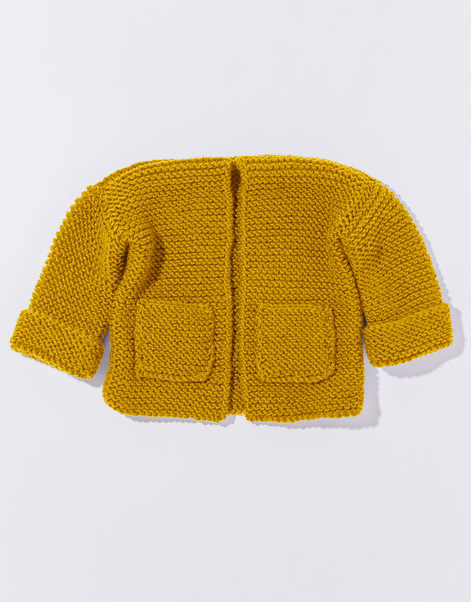
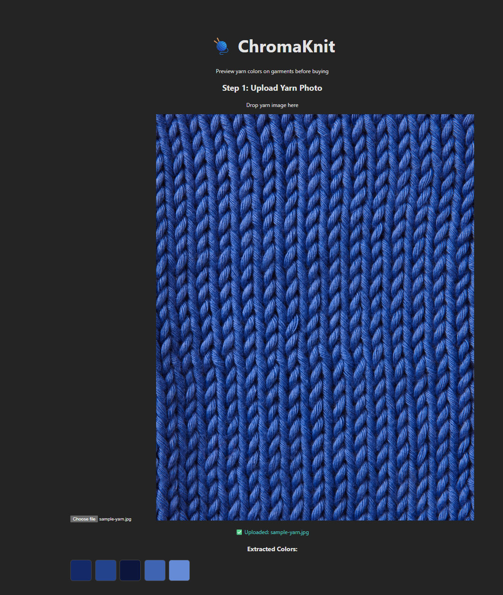

# 🧶 ChromaKnit

Transform garment colors using yarn photos - An intelligent color extraction and garment recoloring system for knitters and designers.

## 📖 Overview

ChromaKnit helps knitters and designers visualize how their yarn colors would look on garments. Upload a photo of your yarn, and ChromaKnit will:

- Extract dominant colors from the yarn using K-means clustering
- Remove backgrounds from garment images automatically
- Recolor garments realistically while preserving texture, shadows, and lighting
- Apply multiple yarn colors for natural-looking results

**Problem it solves:** Knitters often struggle to visualize how their yarn will look when knitted into a specific pattern or garment design. ChromaKnit bridges this gap by providing realistic color previews.

## ✨ Features

### ✅ Phase 1 Complete: Core Processing Engine

**Intelligent Color Extraction**

- K-means clustering for dominant color detection
- Frequency-based color sorting
- Hex code output for easy reference
- Visual color palette generation

**Advanced Garment Recoloring**

- Automatic background removal using AI (rembg)
- HSV color space transformation for realistic results
- Texture and lighting preservation
- Multi-color distribution based on brightness
- Shadow and highlight retention

**Production-Ready Quality**

- Comprehensive test suite (23+ tests for ColorExtractor, 15+ tests for GarmentRecolorer)
- 89-99% code coverage
- Performance benchmarking
- CI/CD with GitHub Actions
- Clean, modular architecture

### ✅ Phase 2 Complete: Backend API

**RESTful API with FastAPI**

- `/api/colors/extract` - Extract dominant colors from yarn images
- `/api/garments/recolor` - Recolor garments with color palettes
- Automatic interactive documentation (Swagger UI)
- Comprehensive error handling with helpful messages
- File upload validation (type, size)
- Flexible input formats (JSON arrays or comma-separated values)

**API Features**

- File size limits (5MB max)
- Multiple input format support
- Proper HTTP status codes (200, 400, 413, 500)
- Temporary file cleanup
- Memory-efficient image processing
- CORS configuration for frontend integration

### 🚧 Phase 3: React Frontend (In Progress)

**✅ Completed Today:**
- React 18 + TypeScript + Vite setup
- Reusable ImageUpload component
  - Click-to-browse file selection
  - Image preview with FileReader API
  - File validation (size, type)
  - TypeScript props interface
- Real-time API integration
  - Automatic color extraction on upload
  - Loading state indicators
  - Error handling with user feedback
- Visual color palette display
  - Interactive color boxes
  - Hover effects
  - Hex code tooltips

**🔜 Coming Tomorrow:**
- Garment upload workflow
- Garment recoloring integration
- Before/after preview
- Full end-to-end user flow

### 📅 Phase 4: Production Deployment (Planned)

- Backend deployment (Railway/Render)
- Frontend deployment (Vercel/Netlify)
- Performance optimizations
- Production monitoring

## 🎨 Results

### Example: Blue Yarn → Yellow Cardigan

| Input Yarn                             | Extracted Colors                                 |
| -------------------------------------- | ------------------------------------------------ |
|  |  |

| Original Garment                                | Recolored Result                                |
| ----------------------------------------------- | ----------------------------------------------- |
|  |  |

_Original garment image from Wool and the Gang_

The yellow cardigan was successfully transformed to blue while **preserving all knit texture, shadows, and folds**!

### Frontend Demo

**Real-time Color Extraction:**
Upload yarn → See colors extracted automatically → Visual palette display



_Screenshot: Live color extraction from blue yarn photo_

## 🏗️ Architecture
```
chromaknit/
├── core/
│   ├── yarn_color_extractor.py  # Color extraction from yarn images
│   ├── garment_recolor.py       # Garment recoloring with texture preservation
│   └── utils.py                 # Shared utilities (color conversion, printing)
├── api/
│   └── main.py                  # FastAPI REST endpoints with CORS
├── chromaknit-frontend/         # React frontend
│   ├── src/
│   │   ├── App.tsx              # Main application component
│   │   ├── ImageUpload.tsx      # Reusable file upload component
│   │   ├── App.css              # Application styles
│   │   ├── main.tsx             # React entry point
│   │   └── index.css            # Global styles
│   ├── package.json             # Node dependencies
│   ├── tsconfig.json            # TypeScript configuration
│   ├── vite.config.ts           # Vite build configuration
│   └── index.html               # HTML shell
├── tests/
│   ├── test_color_extractor.py  # 23 tests, 99% coverage
│   ├── test_garment_recolor.py  # 15 tests, 89% coverage
│   └── test_utils.py            # Utility function tests
├── benchmarks/
│   └── benchmark_color_extractor.py  # Performance testing
├── examples/                    # Sample images
├── results/                     # Output directory
└── main.py                      # Demo workflow
```

## 🛠️ Tech Stack

**Backend:**

- Python 3.11+ - Primary language
- FastAPI - Modern web framework with auto-docs
- OpenCV - Image processing
- NumPy - Numerical operations
- scikit-learn - K-means clustering
- rembg - AI-powered background removal
- Uvicorn - ASGI server

**Frontend:**

- React 18 - UI library
- TypeScript - Type safety and better DX
- Vite - Lightning-fast build tool and dev server
- CSS3 - Custom styling with modern features

**Development Tools:**

- pytest - Testing framework
- pytest-cov - Code coverage
- GitHub Actions - CI/CD pipeline
- Git - Version control

## 🚀 Getting Started

### Prerequisites

- Python 3.11 or higher
- Node.js 18+ and npm
- pip (Python package manager)

### Backend Setup

1. **Clone the repository:**
```bash
git clone https://github.com/charlyx125/chromaknit.git
cd chromaknit
```

2. **Create virtual environment:**
```bash
python -m venv venv

# Windows
venv\Scripts\activate

# macOS/Linux
source venv/bin/activate
```

3. **Install dependencies:**
```bash
pip install -r requirements-api.txt
```

4. **Start API server:**
```bash
uvicorn api.main:app --reload
```

**API available at:** http://localhost:8000  
**Interactive docs:** http://localhost:8000/docs

### Frontend Setup

1. **Navigate to frontend directory:**
```bash
cd chromaknit-frontend
```

2. **Install dependencies:**
```bash
npm install
```

3. **Start development server:**
```bash
npm run dev
```

**Frontend available at:** http://localhost:5173

### Full Stack Development

**For the complete development experience, run both servers:**

**Terminal 1 - Backend:**
```bash
cd chromaknit
source venv/bin/activate  # Windows: venv\Scripts\activate
uvicorn api.main:app --reload
```

**Terminal 2 - Frontend:**
```bash
cd chromaknit-frontend
npm run dev
```

**Benefits:**
- ⚡ Hot reload on both frontend and backend
- 🔄 Real-time API integration
- 🎨 Instant visual feedback
- 🐛 Easy debugging across the stack

**Open browser:** http://localhost:5173

## 💻 Usage

### Option 1: Web Interface (Recommended)

1. **Start both servers** (see Full Stack Development above)
2. **Open http://localhost:5173 in browser**
3. **Upload yarn image:**
   - Click upload area or drag-and-drop
   - See image preview
   - Colors extracted automatically
4. **View color palette:**
   - Visual color boxes
   - Hover to see hex codes
5. **Upload garment:** (Coming tomorrow!)
6. **Download recolored result:** (Coming tomorrow!)

### Option 2: Use the REST API Directly

**Start API server:**
```bash
uvicorn api.main:app --reload
```

**Access interactive documentation:**

- Swagger UI: http://127.0.0.1:8000/docs
- ReDoc: http://127.0.0.1:8000/redoc

**API Workflow:**

1. **Extract colors from yarn:**

   - POST to `/api/colors/extract`
   - Upload yarn image
   - Receive: `{"success": true, "colors": ["#142a68", "#23438d"], "count": 2}`

2. **Recolor garment:**
   - POST to `/api/garments/recolor`
   - Upload garment image
   - Provide colors (JSON array or comma-separated)
   - Download recolored garment

**Example with curl:**
```bash
# Extract colors
curl -X POST "http://127.0.0.1:8000/api/colors/extract" \
  -F "file=@examples/sample-yarn.jpg" \
  -F "n_colors=5"

# Recolor garment
curl -X POST "http://127.0.0.1:8000/api/garments/recolor" \
  -F "file=@examples/sample-garment.jpg" \
  -F "colors=#142a68,#23438d,#0c153b" \
  --output recolored.png
```

### Option 3: Use Python Directly

**Extract Colors from Yarn:**
```python
from core.yarn_color_extractor import ColorExtractor

# Extract 5 dominant colors
extractor = ColorExtractor(image_path="yarn.jpg", n_colors=5)
colors = extractor.extract_dominant_colors()

# Visualize results
extractor.visualize_colors(output_path="results/colors.png")

print(colors)  # ['#142a68', '#23438d', '#0c153b', '#3e64b2', '#658ad6']
```

**Recolor a Garment:**
```python
from core.garment_recolor import GarmentRecolorer

# Create recolorer
recolorer = GarmentRecolorer(garment_image_path="sweater.jpg")

# Recolor with extracted yarn colors
recolored_image = recolorer.recolor_garment(target_colors=colors)

# Save result
recolorer.save_result(output_path="results/recolored_sweater.png")
```

## 🧪 Testing

**Backend tests:**
```bash
# Run all tests
pytest tests/ -v

# Test with coverage
pytest tests/ --cov=core --cov=api --cov-report=term-missing

# Run specific test suite
pytest tests/test_color_extractor.py -v
```

**Frontend development:**
```bash
cd chromaknit-frontend

# Start dev server with hot reload
npm run dev

# Build for production
npm run build

# Preview production build
npm run preview
```

## 📊 Technical Approach

### Color Extraction

- **Algorithm:** K-means clustering in RGB space
- **Optimization:** Configurable cluster count, random seed for reproducibility
- **Output:** Sorted by frequency, hex codes with percentages

### Garment Recoloring

- **Color Space:** HSV (Hue, Saturation, Value)
  - H: Changed to yarn color hue
  - S: Changed to yarn color saturation
  - V: Preserved from original (maintains texture/lighting!)
- **Multi-Color:** Brightness-based distribution (dark areas → dark yarn colors)
- **Background Removal:** rembg with U²-Net model

### Frontend Architecture

- **Component-Based:** Reusable ImageUpload component with TypeScript props
- **State Management:** React hooks (useState, useEffect) for reactive UI
- **API Integration:** Fetch API with async/await and error handling
- **Real-Time Updates:** Automatic color extraction on upload
- **Type Safety:** Full TypeScript coverage for compile-time error detection

### API Design

- **Layered validation:** File type → File size → Processing quality
- **Flexible input:** Accepts JSON arrays or comma-separated color values
- **Proper HTTP semantics:** Uses appropriate status codes (200, 400, 413, 500)
- **Memory efficient:** Streams large files, temporary file cleanup
- **CORS configured:** Allows frontend-backend communication during development

## ⚠️ Known Limitations

- **Foreground Detection:** Currently recolors all detected foreground objects (may include person, not just garment)
- **Best Results:** Works optimally with solid-colored garments on simple backgrounds
- **Processing Time:** 
  - Color extraction: ~1 second
  - Background removal: 5-10 seconds for large images
- **Color Distribution:** Simple brightness-based mapping (future: more sophisticated algorithms)
- **File Size Limit:** 5MB maximum for API uploads
- **Mobile UI:** Not yet optimized for mobile devices (coming in Phase 4)

## 🗺️ Roadmap

### ✅ Phase 1: Core Processing (Complete)

- ✅ Color extraction from yarn images
- ✅ Garment recoloring with texture preservation
- ✅ Comprehensive test suite
- ✅ Performance benchmarks
- ✅ CI/CD pipeline

### ✅ Phase 2: Backend API (Complete)

- ✅ FastAPI REST endpoints
- ✅ File upload handling
- ✅ Request/response validation
- ✅ API documentation (Swagger/ReDoc)
- ✅ Error handling with helpful messages
- ✅ Flexible input format support
- ✅ CORS configuration

### 🚧 Phase 3: Frontend Interface (In Progress - 50% Complete)

- ✅ React + TypeScript + Vite setup
- ✅ Image upload component with validation
- ✅ Real-time color extraction
- ✅ Visual color palette display
- 🔜 Garment upload workflow
- 🔜 Garment recoloring integration
- 🔜 Before/after comparison view
- 🔜 Responsive design
- 🔜 Loading states and animations

### 📅 Phase 4: Polish & Deployment (Planned)

- UI/UX improvements
- Drag-and-drop upload
- Mobile responsive design
- Error message styling
- Backend deployment (Railway/Render)
- Frontend deployment (Vercel/Netlify)
- Production monitoring
- Rate limiting
- Performance optimizations

## 🤝 Contributing

This is a personal learning project, but feedback and suggestions are welcome!

1. Fork the repository
2. Create a feature branch (`git checkout -b feature/amazing-feature`)
3. Commit your changes (`git commit -m 'Add amazing feature'`)
4. Push to the branch (`git push origin feature/amazing-feature`)
5. Open a Pull Request

## 📝 License

This project is open source and available under the MIT License.

## 👤 Author

**Joyce Chong**

- GitHub: [@charlyx125](https://github.com/charlyx125)
- Project: [ChromaKnit](https://github.com/charlyx125/chromaknit)

## 🙏 Acknowledgments

- [scikit-learn](https://scikit-learn.org/) - K-means clustering implementation
- [rembg](https://github.com/danielgatis/rembg) - AI-powered background removal
- [OpenCV](https://opencv.org/) - Computer vision tools
- [FastAPI](https://fastapi.tiangolo.com/) - Modern Python web framework
- [React](https://react.dev/) - UI library
- [Vite](https://vitejs.dev/) - Next generation frontend tooling
- Inspiration from the knitting and maker community

## 📚 Documentation

For detailed technical decisions and architecture documentation, see:

- `docs/decisions/001-color-extraction-algorithm.md`
- `docs/decisions/002-background-removal-strategy.md`
- `docs/decisions/003-api-design-decisions.md`

---

Built with ❤️ for knitters and designers  
_Last updated: January 8, 2026 - Phase 3A Complete_