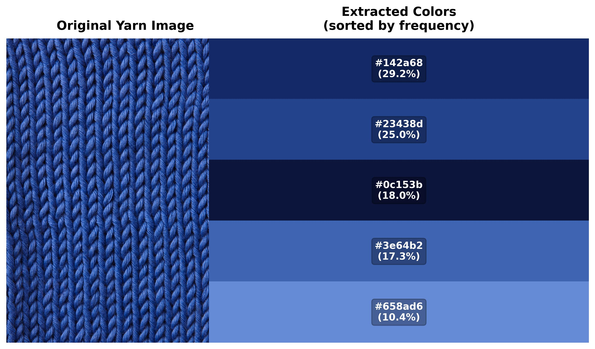

# ChromaKnit 🧶

> Visualize yarn colors on garments before buying - because £50 mistakes hurt.

[](https://www.python.org/downloads/)
[](https://opencv.org/)
[](https://github.com/charlyx125/chromaknit)
[](LICENSE)

---

## 🎯 The Problem

I kept making expensive yarn purchasing mistakes when shopping online for multi-color knitting projects. Colors look completely different based on proportions and what surrounds them (color theory!), making it impossible to visualize how MY chosen colors would look in a specific pattern. ChromaKnit solves this: extract colors from any yarn photo and apply them to any garment image before purchasing.

**[Read the full story →](docs/development-log.md#phase-0-the-problem)**

---

## ✨ Current Status

**Phase 1: Color Extraction** ✅ Complete

Extracts the 5 most dominant colors from yarn photos using K-means clustering, ranks them by frequency, and outputs hex codes with visual palettes. Handles variegated, speckled, and solid yarns. Works via command-line interface.

**Phase 2: Garment Recoloring** 🚧 In Progress  
**Phase 3: Web Interface** 📋 Planned

---

## 🚀 Quick Start
```bash
# Clone and setup
git clone https://github.com/charlyx125/chromaknit.git
cd chromaknit
python -m venv venv
source venv/bin/activate  # Windows: venv\Scripts\activate
pip install opencv-python numpy scikit-learn matplotlib

# Run
# 1. Add yarn photo to photos/ folder
# 2. Update IMAGE_PATH in yarn_color_extractor.py
python yarn_color_extractor.py

# 3. Check results/yarn_colors.png for output
```

## 📸 Demo

### Input

*Close-up photo of blue variegated yarn (taken from wool and the gang website)*

### Output

*5 dominant colors extracted and ranked by frequency*

**Extracted Colors:**
| Rank | %       | Color | Hex Code |
|------|---------|-------|----------|
| 1    | 29.21%  |  | `#142a68` |
| 2    | 24.98%  |  | `#23438d` |
| 3    | 18.04%  |  | `#0c153b` |
| 4    | 17.32%  |  | `#3e64b2` |
| 5    | 10.45%  |  | `#658ad6` |

---

## 🧠 How It Works

K-means clustering analyzes all pixels in a yarn photo and groups them into 5 color clusters based on RGB similarity. Colors are ranked by frequency (most common first) to show which are dominant vs. accents. The algorithm outputs hex codes and generates a visual palette showing the original image alongside extracted colors.

**[Technical deep dive →](docs/development-log.md#phase-1-color-extraction)**

---

## 🤔 Current Challenge

Yarn photos are taken close-up, but garments are viewed from distance - colors optically blend differently at different scales. Should we filter out very dark pixels (likely shadows/artifacts) or keep them for realistic recoloring? Postponing this decision until Phase 2 when we can A/B test both approaches with actual garment results.

**[Read the full analysis →](docs/development-log.md#challenge-1-the-close-up-vs-distance-problem)**

---

## 🗺️ Roadmap

- ✅ **Phase 1:** Color extraction (Complete)
- 🚧 **Phase 2:** Garment recoloring (Next)
- 📋 **Phase 3:** Multi-color support
- 🎨 **Phase 4:** Web interface
- 🚀 **Phase 5:** Advanced features (yarn database, color harmony suggestions)

**[Detailed roadmap →](docs/development-log.md)**

---

## 📚 Documentation

**[📖 Development Log](docs/development-log.md)** - The complete story of building ChromaKnit, including the problem that motivated it, technical decisions and reasoning, challenges faced and solutions, and lessons learned.

Perfect for understanding how real-world problems drive technical decisions and the iterative nature of software development.

---

## 🛠️ Tech Stack

**Current:** Python 3.10+, OpenCV, NumPy, scikit-learn, Matplotlib  
**Planned:** FastAPI, React, Rembg/SAM, Docker, Vercel/Railway

**[Technical decisions explained →](docs/development-log.md#key-technical-decisions)**

---

## 📊 Project Structure
```
chromaknit/
├── yarn_color_extractor.py    # Main script
├── photos/                     # Input images (gitignored)
├── results/                    # Output visualizations (gitignored)
├── docs/                       # Project documentation
│   ├── development-log.md      # Development journey
│   ├── decisions/              # Technical decision records
│   └── findings.md             # Experimental results
└── README.md
```

---

## 🎓 What I'm Learning

This project helps me develop computer vision fundamentals, clean code architecture, and documentation-driven development practices. The most valuable lesson: not all decisions can be made upfront - sometimes you need to build more, gather data, and iterate. Being comfortable with uncertainty is part of engineering.

**[Lessons learned →](docs/development-log.md#lessons-learned)**

---

## 🤝 About

**Built by:** [Joyce Chong](https://github.com/charlyx125)

Personal frustration with expensive yarn purchasing mistakes led to this technical solution. Sometimes the best projects come from solving your own problems.

---

## 🌟 Follow Along

- ⭐ **Star** this repo for updates
- 📖 **Read** the [development log](docs/development-log.md) to see the problem-solving process  
- 💬 **Discuss** - Open an issue with questions or ideas

---

**MIT License** | **Last Updated:** November 7, 2025
