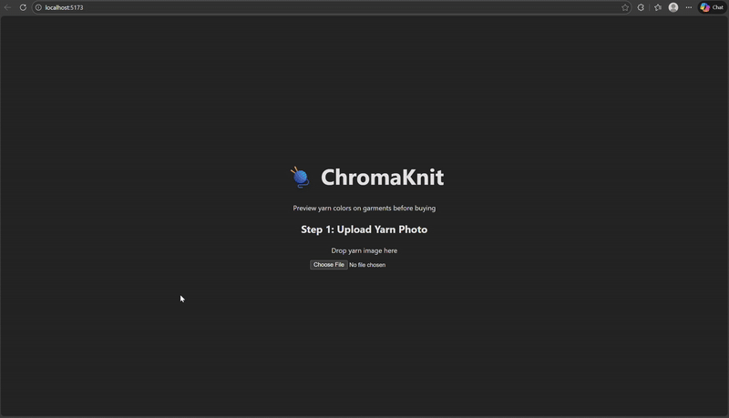
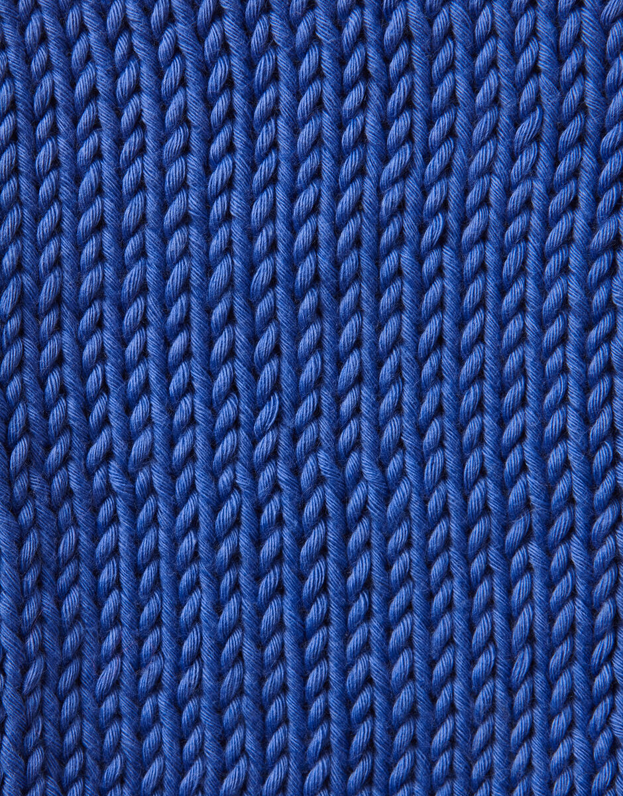
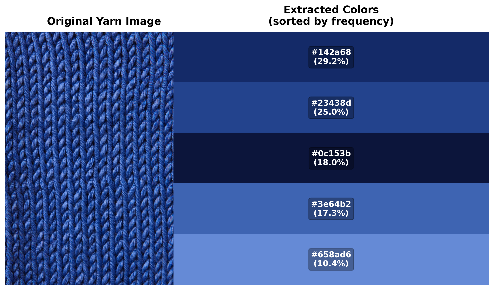
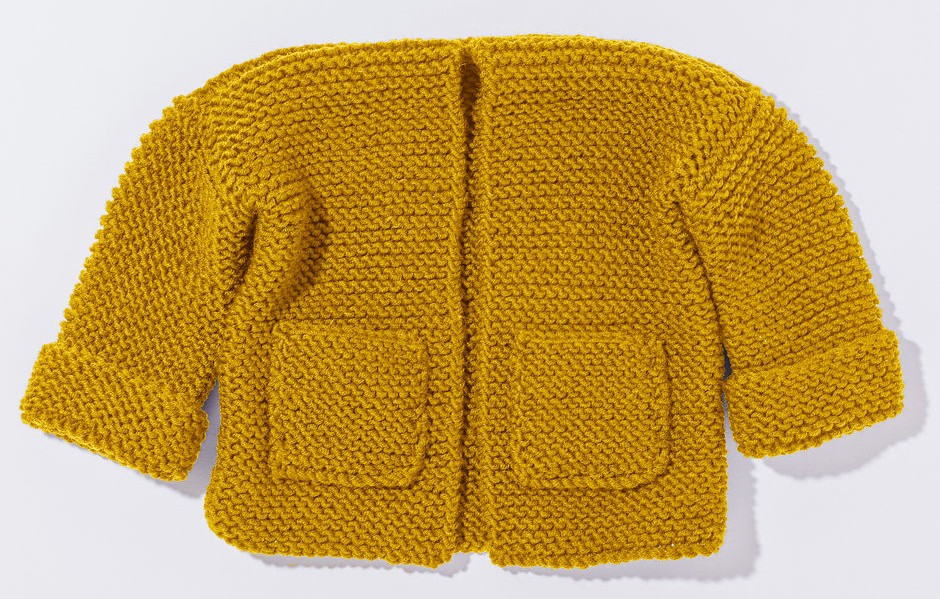
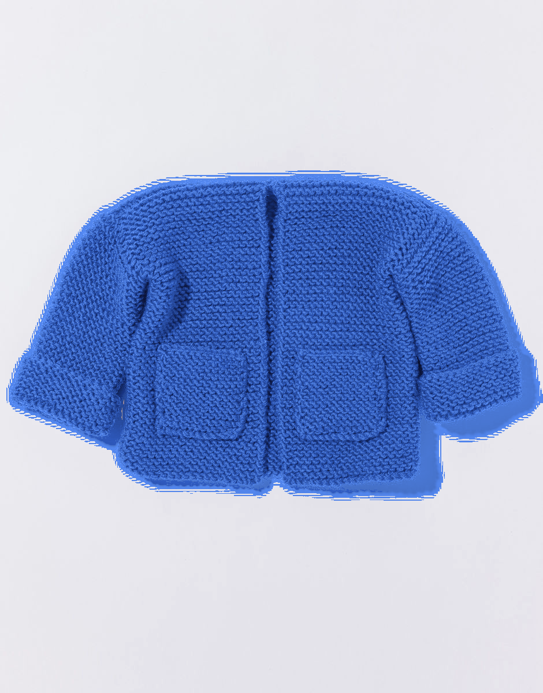

# 🧶 ChromaKnit

**Visualize how your yarn will look on any garment — before you knit a single stitch.**

🌐 **[Try it live →](https://chromaknit.vercel.app)**



Upload yarn photo → Extract colors automatically → Recolor any garment

> **Note:** Backend hosted on Railway (no cold starts). See [Deployment Guide](docs/DEPLOYMENT.md) for details.

---

## The Problem

Knitters spend hours (and money) on yarn, only to discover the finished garment doesn't look how they imagined. ChromaKnit lets you preview yarn colors on garments *before* committing to a project.

## ✨ Features

| Feature | Description | Details |
|---------|-------------|---------|
| **Color Extraction** | K-means clustering extracts dominant colors from yarn photos | [ADR 001](docs/decisions/001-yarn-color-extraction.md) |
| **Background Removal** | AI-powered segmentation (rembg/U²-Net) isolates garments | [ADR 002](docs/decisions/002-recoloring-strategy.md) |
| **Realistic Recoloring** | HSV transformation preserves texture, shadows, and lighting | [ADR 002](docs/decisions/002-recoloring-strategy.md) |
| **REST API** | FastAPI endpoints with Swagger docs at `/docs` | [ADR 003](docs/decisions/003-api-design.md) |
| **React Frontend** | TypeScript + Vite with real-time color extraction | [ADR 004](docs/decisions/004-react-frontend-architecture.md) |
| **UI Design** | Frosted glass header, tabbed workspace, before/after slider | [ADR 006](docs/decisions/006-ui-redesign.md) |
| **Report Issue** | In-app issue reporting — users pick a category and submit directly to GitHub Issues | — |

**Status:** ✅ Phases 1-4 Complete

## 🎨 Results

### Example: Blue Yarn → Yellow Cardigan

| Input Yarn                             | Extracted Colors                                 |
| -------------------------------------- | ------------------------------------------------ |
|  |  |

| Original Garment                                | Recolored Result                                |
| ----------------------------------------------- | ----------------------------------------------- |
|  |  |

_Original garment image from Wool and the Gang_

The yellow cardigan was successfully transformed to blue while **preserving all knit texture, shadows, and folds**!

## 🏗️ Architecture
```
chromaknit/
├── core/
│   ├── yarn_color_extractor.py  # Color extraction from yarn images
│   ├── garment_recolor.py       # Garment recoloring with texture preservation
│   └── utils.py                 # Shared utilities (color conversion, printing)
├── api/
│   └── main.py                  # FastAPI REST endpoints with CORS
├── chromaknit-frontend/         # React frontend
│   ├── public/
│   │   └── header-yarn-background.jpg  # Header background image
│   ├── src/
│   │   ├── App.tsx              # Main application (state + API logic)
│   │   ├── App.css              # All component styles (~900 lines)
│   │   ├── index.css            # Design system variables + keyframes
│   │   ├── config.ts            # API base URL configuration
│   │   ├── main.tsx             # React entry point
│   │   └── components/
│   │       ├── Header.tsx       # Frosted glass header with CTA
│   │       ├── PetalBackground.tsx  # Fixed background + floating petals
│   │       ├── BuilderNotes.tsx # Collapsible tech stack panel
│   │       ├── SampleStrip.tsx  # Tabbed workspace (pick yarn → upload garment → result)
│   │       ├── StepSection.tsx  # Reusable step wrapper
│   │       ├── InfoPanel.tsx    # Expandable info tooltips
│   │       ├── UploadZone.tsx   # Styled file upload dropzone with sample images
│   │       ├── ColorPalette.tsx # Colour swatches + distribution bar
│   │       ├── LoadingCat.tsx   # Cat + yarn ball loading animation
│   │       ├── BeforeAfter.tsx  # Draggable comparison slider
│   │       └── ReportIssue.tsx  # Floating issue reporter → GitHub Issues
│   ├── package.json             # Node dependencies
│   ├── tsconfig.json            # TypeScript configuration
│   ├── vite.config.ts           # Vite build configuration
│   └── index.html               # HTML shell + Google Fonts
├── tests/
│   ├── test_color_extractor.py  # Color extraction tests
│   ├── test_garment_recolor.py  # Garment recoloring tests
│   └── test_utils.py            # Utility function tests
├── benchmarks/
│   ├── benchmark_color_extractor.py  # Color extraction benchmarks
│   ├── benchmark_recolor_garment.py  # Recoloring benchmarks
│   ├── benchmark_full_workflow.py    # End-to-end workflow benchmarks
│   └── workflow_results.md           # Latest benchmark results
├── examples/                    # Sample images
├── results/                     # Output directory
└── main.py                      # Demo workflow
```

## 🛠️ Tech Stack

**Backend:**

- Python 3.11+ - Primary language
- FastAPI - Modern web framework with auto-docs
- OpenCV - Image processing
- NumPy - Numerical operations
- scikit-learn - K-means clustering
- rembg - AI-powered background removal
- Uvicorn - ASGI server

**Frontend:**

- React 19 - UI library
- TypeScript - Type safety and better DX
- Vite - Lightning-fast build tool and dev server
- Cormorant Garamond + DM Sans - Typography (Google Fonts)
- CSS3 - Custom design system with frosted glass effects, CSS variables, keyframe animations

**Development Tools:**

- pytest - Testing framework
- pytest-cov - Code coverage
- GitHub Actions - CI/CD pipeline
- Git - Version control

## 🚀 Getting Started

### Prerequisites

- Python 3.11 or higher
- Node.js 18+ and npm
- pip (Python package manager)

### Backend Setup

1. **Clone the repository:**
```bash
git clone https://github.com/charlyx125/chromaknit.git
cd chromaknit
```

2. **Create virtual environment:**
```bash
python -m venv venv

# Windows
venv\Scripts\activate

# macOS/Linux
source venv/bin/activate
```

3. **Install dependencies:**
```bash
pip install -r requirements-api.txt
```

4. **Start API server:**
```bash
uvicorn api.main:app --reload
```

**API available at:** http://localhost:8000  
**Interactive docs:** http://localhost:8000/docs

### Frontend Setup

1. **Navigate to frontend directory:**
```bash
cd chromaknit-frontend
```

2. **Install dependencies:**
```bash
npm install
```

3. **Start development server:**
```bash
npm run dev
```

**Frontend available at:** http://localhost:5173

### Full Stack Development

**For the complete development experience, run both servers:**

**Terminal 1 - Backend:**
```bash
cd chromaknit
source venv/bin/activate  # Windows: venv\Scripts\activate
uvicorn api.main:app --reload
```

**Terminal 2 - Frontend:**
```bash
cd chromaknit-frontend
npm run dev
```

**Benefits:**
- ⚡ Hot reload on both frontend and backend
- 🔄 Real-time API integration
- 🎨 Instant visual feedback
- 🐛 Easy debugging across the stack

**Open browser:** http://localhost:5173

## 💻 Usage

### Option 1: Web Interface (Recommended)

1. **Start both servers** (see Full Stack Development above)
2. **Open http://localhost:5173 in browser**
3. **Click "try it now"** on the header to begin
4. **Tab 1 — Pick yarn:**
   - Click a sample yarn swatch or the "+" card to upload your own
   - Colours are extracted automatically (loading animation while processing)
   - Extracted palette appears below the swatches
5. **Tab 2 — Upload garment:**
   - Upload a garment photo or pick a sample
   - Click "recolour garment" button
   - Progress animation plays while processing
6. **Tab 3 — Result:**
   - Drag the slider to compare original vs recoloured garment
   - Download the result or start over
7. **Report an issue:** Click the floating icon (bottom-right) to report problems directly to GitHub Issues

### Option 2: Use the REST API Directly

**Start API server:**
```bash
uvicorn api.main:app --reload
```

**Access interactive documentation:**

- Swagger UI: http://127.0.0.1:8000/docs
- ReDoc: http://127.0.0.1:8000/redoc

**API Workflow:**

1. **Extract colors from yarn:**

   - POST to `/api/colors/extract`
   - Upload yarn image
   - Receive: `{"success": true, "colors": ["#142a68", "#23438d"], "count": 2}`

2. **Recolor garment:**
   - POST to `/api/garments/recolor`
   - Upload garment image
   - Provide colors (JSON array or comma-separated)
   - Download recolored garment

**Example with curl:**
```bash
# Extract colors
curl -X POST "http://127.0.0.1:8000/api/colors/extract" \
  -F "file=@examples/yarn/sample-yarn.jpg" \
  -F "n_colors=10"

# Recolor garment
curl -X POST "http://127.0.0.1:8000/api/garments/recolor" \
  -F "file=@examples/garment/sample-garment.jpg" \
  -F "colors=#142a68,#23438d,#0c153b" \
  --output recolored.png
```

### Option 3: Use Python Directly

**Extract Colors from Yarn:**
```python
from core.yarn_color_extractor import ColorExtractor

# Extract 10 dominant colors (captures shadow and highlight tones)
extractor = ColorExtractor(image_path="yarn.jpg", n_colors=10)
colors = extractor.extract_dominant_colors()

# Visualize results
extractor.visualize_colors(output_path="results/colors.png")

print(colors)  # ['#142a68', '#23438d', '#0c153b', '#3e64b2', '#658ad6']
```

**Recolor a Garment:**
```python
from core.garment_recolor import GarmentRecolorer

# Create recolorer
recolorer = GarmentRecolorer(garment_image_path="sweater.jpg")

# Recolor with extracted yarn colors
recolored_image = recolorer.recolor_garment(target_colors=colors)

# Save result
recolorer.save_result(output_path="results/recolored_sweater.png")
```

## 🧪 Testing

**Backend tests:**
```bash
# Run all tests
pytest tests/ -v

# Test with coverage
pytest tests/ --cov=core --cov=api --cov-report=term-missing

# Run specific test suite
pytest tests/test_color_extractor.py -v
```

**Frontend development:**
```bash
cd chromaknit-frontend

# Start dev server with hot reload
npm run dev

# Build for production
npm run build

# Preview production build
npm run preview
```

## 📊 Technical Approach

### Color Extraction ([ADR 001](docs/decisions/001-yarn-color-extraction.md))

- **Algorithm:** K-means clustering in RGB space
- **Optimization:** Configurable cluster count, random seed for reproducibility
- **Output:** Sorted by frequency, hex codes with percentages

### Garment Recoloring ([ADR 002](docs/decisions/002-recoloring-strategy.md))

- **Color Space:** HSV (Hue, Saturation, Value)
  - H: Changed to yarn color hue
  - S: Changed to yarn color saturation
  - V: Remapped from garment range to yarn range (preserves relative texture while matching yarn brightness)
- **Multi-Color:** Distribution-weighted mapping using extraction percentages (dark yarn = more dark pixels)
- **Background Removal:** rembg with u2netp model

### Frontend Architecture ([ADR 004](docs/decisions/004-react-frontend-architecture.md), [ADR 006](docs/decisions/006-ui-redesign.md))

- **Component-Based:** 11 focused components (Header, PetalBackground, SampleStrip, StepSection, UploadZone, ColorPalette, LoadingCat, BeforeAfter, InfoPanel, BuilderNotes, ReportIssue)
- **State Management:** React hooks (useState, useEffect, useRef) — all state in App.tsx, components are presentational
- **API Integration:** Fetch API with async/await, AbortController for cancellation, and error handling
- **Tabbed Workspace:** Three-tab workflow (pick yarn → upload garment → result) with fanned yarn sample cards
- **Design System:** 9-token colour palette, Cormorant Garamond + DM Sans typography, frosted glass header with `backdrop-filter: blur(28px)`
- **Before/After Slider:** Draggable comparison using `clip-path: inset()` with mouse, touch, and range input support
- **Issue Reporting:** Floating report button that opens pre-filled GitHub Issues with categorised templates
- **Type Safety:** Full TypeScript coverage for compile-time error detection

### API Design ([ADR 003](docs/decisions/003-api-design.md))

- **Layered validation:** File type → File size → Processing quality
- **Flexible input:** Accepts JSON arrays or comma-separated color values
- **Proper HTTP semantics:** Uses appropriate status codes (200, 400, 413, 500)
- **Memory efficient:** Streams large files, temporary file cleanup
- **CORS configured:** Allows frontend-backend communication during development

## ⚡ Performance Benchmarks ([ADR 005](docs/decisions/005-performance-optimization-strategy.md))

**Test Environment:**
- Machine: LG GRAM
- Test Date: February 2026
- Methodology: Synthetic test images, timed operations with psutil memory tracking

### Individual Operations

| Operation | Small (300x300) | Medium (800x800) | Large (1920x1080) |
|-----------|-----------------|------------------|-------------------|
| Color Extraction | 3.382s | 3.797s | 7.014s |
| Garment Recoloring | 1.746s | 1.863s | 1.766s |
| **Partial Total** | **5.128s** | **5.660s** | **8.780s** |

**Note:** Recoloring time includes background removal (rembg model loading ~1.5s)
plus HSV transformation (~0.2s). Background removal dominates, making recoloring
time nearly constant regardless of image size.

### Full Workflow (Measured)

Complete end-to-end workflow (yarn color extraction → background removal → garment recoloring):

| Image Size | Extraction | Bg Removal | Recolor | **Total** | Memory |
|------------|------------|------------|---------|-----------|--------|
| Small (300x300) | 2.87s | 1.63s | 0.01s | **4.51s** | 262 MB |
| Medium (800x800) | 2.63s | 1.56s | 0.01s | **4.20s** | 271 MB |
| Large (1920x1080) | 7.34s | 1.70s | 0.04s | **9.09s** | 293 MB |

**Bottleneck Analysis:**

| Size | Bottleneck | % of Total |
|------|------------|------------|
| Small | Color Extraction | 63.7% |
| Medium | Color Extraction | 62.5% |
| Large | Color Extraction | 80.8% |

**Key Findings:**
- **Color Extraction** was the clear bottleneck (K-means clustering scales with pixel count)
- **Background Removal** stays constant (~1.6s locally) due to fixed model inference time
- **Garment Recoloring** is negligible (<0.05s)

### Production Performance (Railway Free Tier)

After optimizations (April 2026), production performance on Railway's constrained CPU:

| Operation | Before | After | Improvement |
|-----------|--------|-------|-------------|
| Color Extraction | 72s | 487–711ms | **~100-150x faster** |
| Garment Recoloring | 34s | 1.8–37s | **~1-19x faster** |

> **Note:** Recoloring has a wide range because rembg's neural network is lazy-loaded to keep idle memory under 512MB. The first recolor after idle (~37s) pays the model loading cost. Every subsequent request is fast (~1.8s). This is a deliberate trade-off — low idle memory vs. cold-start latency.

**Optimizations applied:**
1. **Frontend image resize** - yarn to 400x400, garment to 500x500 before uploading
2. **MiniBatchKMeans** - samples batches instead of processing all pixels, n_init reduced from 10 to 3
3. **Lightweight rembg model** - `u2netp` uses ~50% less memory than default `u2net`
4. **Server-side downscale safety net** - caps image dimensions before processing

**See full benchmarks:** [benchmarks/](./benchmarks/) | **See optimization details:** [ADR 005](docs/decisions/005-performance-optimization-strategy.md)

## ⚠️ Known Limitations

- **Foreground Detection:** Currently recolors all detected foreground objects (may include person, not just garment)
- **Best Results:** Works optimally with solid-colored garments on simple backgrounds
- **Processing Time:** (see [Performance Benchmarks](#-performance-benchmarks) for details)
  - Color extraction: 487–711ms on Railway free tier (optimized with MiniBatchKMeans + frontend resize)
  - Background removal + recoloring: 1.8–37s on Railway free tier (first request loads model ~37s, subsequent ~1.8s)
  - Total workflow: ~2.3s warm, ~38s cold
- **Color Distribution:** Simple brightness-based mapping (future: more sophisticated algorithms)
- **File Size Limit:** 5MB maximum for API uploads
- **Mobile UI:** Basic responsive breakpoint at 600px, but not fully polished for small screens

## 🗺️ Roadmap

### ✅ Phase 1: Core Processing (Complete)

- ✅ Color extraction from yarn images
- ✅ Garment recoloring with texture preservation
- ✅ Comprehensive test suite
- ✅ Performance benchmarks
- ✅ CI/CD pipeline

### ✅ Phase 2: Backend API (Complete)

- ✅ FastAPI REST endpoints
- ✅ File upload handling
- ✅ Request/response validation
- ✅ API documentation (Swagger/ReDoc)
- ✅ Error handling with helpful messages
- ✅ Flexible input format support
- ✅ CORS configuration

### ✅ Phase 3: Frontend Interface (Complete)

- ✅ React + TypeScript + Vite setup
- ✅ Image upload component with validation
- ✅ Real-time color extraction
- ✅ Visual color palette with distribution bar
- ✅ Garment upload workflow
- ✅ Garment recoloring integration
- ✅ Draggable before/after comparison slider
- ✅ Start Over reset functionality
- ✅ UI redesign: frosted glass header, tabbed workspace, petal animations
- ✅ Fanned yarn sample cards with hover/select animations
- ✅ Sample garment images in upload zones
- ✅ Cat + yarn ball loading animation
- ✅ Collapsible builder notes and info panels
- ✅ Custom design system (Cormorant Garamond + DM Sans, 9-token colour palette)
- ✅ In-app issue reporting via GitHub Issues

### ✅ Phase 4: Polish & Deployment (Complete)

- ✅ Backend deployment (Railway) - https://chromaknit-production.up.railway.app
- ✅ Frontend deployment (Vercel) - https://chromaknit.vercel.app
- ✅ Lazy loading optimization for memory-constrained hosting
- ✅ CORS configuration for production
- Drag-and-drop upload with drag events (future)
- Mobile responsive polish (future)
- Performance optimizations (future)
- More whimsical interactive elements (future)

## 🤝 Contributing

This is a personal learning project, but feedback and suggestions are welcome!

1. Fork the repository
2. Create a feature branch (`git checkout -b feature/amazing-feature`)
3. Commit your changes (`git commit -m 'Add amazing feature'`)
4. Push to the branch (`git push origin feature/amazing-feature`)
5. Open a Pull Request

## 📝 License

This project is open source and available under the MIT License.

## 👤 Author

**Joyce Chong**

- GitHub: [@charlyx125](https://github.com/charlyx125)
- Project: [ChromaKnit](https://github.com/charlyx125/chromaknit)

## 🙏 Acknowledgments

- [scikit-learn](https://scikit-learn.org/) - K-means clustering implementation
- [rembg](https://github.com/danielgatis/rembg) - AI-powered background removal
- [OpenCV](https://opencv.org/) - Computer vision tools
- [FastAPI](https://fastapi.tiangolo.com/) - Modern Python web framework
- [React](https://react.dev/) - UI library
- [Vite](https://vitejs.dev/) - Next generation frontend tooling
- Inspiration from the knitting and maker community

## 📚 Documentation

For detailed technical decisions and architecture documentation, see:

- **[Architecture Overview](docs/ARCHITECTURE.md)** - System design, data flow, component interaction
- **[Deployment Guide](docs/DEPLOYMENT.md)** - Production URLs, cold start info, troubleshooting
- [ADR 001: Yarn Color Extraction](docs/decisions/001-yarn-color-extraction.md) - K-means clustering selection
- [ADR 002: Recoloring Strategy](docs/decisions/002-recoloring-strategy.md) - rembg/U²-Net selection
- [ADR 003: API Design](docs/decisions/003-api-design.md) - FastAPI REST endpoints
- [ADR 004: Frontend Architecture](docs/decisions/004-react-frontend-architecture.md) - React + TypeScript decisions
- [ADR 005: Performance Optimization](docs/decisions/005-performance-optimization-strategy.md) - Bottleneck analysis and optimization strategies
- [ADR 006: UI Redesign](docs/decisions/006-ui-redesign.md) - Frosted glass header, step-based workflow, design system

---

Built with ❤️ for knitters and designers
_Last updated: April 12, 2026 - Tabbed workspace, yarn sample cards, in-app issue reporting_