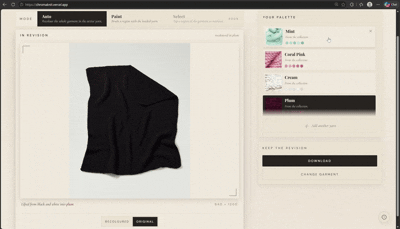
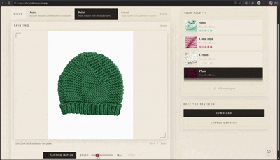

# Chromaknit

Try the yarn before you cast on. Upload yarn, pick a garment, recolour it with the texture intact. Multi-yarn palette, paint mode for colourwork, all running on free tiers.

**[Try it live](https://chromaknit.vercel.app)** &nbsp;·&nbsp; **[Read the decisions](docs/decisions/)** &nbsp;·&nbsp; **[Architecture overview](docs/ARCHITECTURE.md)**

> The backend sleeps on idle (HuggingFace Spaces free tier). The first upload after a long quiet period takes 30 to 60 seconds while the container wakes. Sample yarns and garments run entirely in the browser and never hit the backend, so clicking around the demo is always instant.

---

## See it in motion

### Auto mode: pick a yarn, the whole garment recolours



### Paint mode: brush regions for colourwork and stripes



> The GIFs above are recorded against the real app. Replace with fresh captures after each major UI change.

---

## The problem

Knitters spend a lot of money on yarn before knowing how it will look on the finished piece. Stash photos do not preview well. Yarn shops do not stock every colourway. ChromaKnit lets you stage a recolour against a real garment photo before committing.

The MVP was single yarn, whole-garment auto recolour. The current version (v2) extends that to a Procreate-style canvas: a palette of yarns, paint strokes for stripes and fair isle, and a single region-mask engine underneath that handles all modes.

## How it works

1. **Extract.** K-means in RGB on a downscaled yarn image returns up to ten dominant colours with their frequencies. MiniBatchKMeans on the backend, downscale to 400px on the frontend before upload. See [ADR 001](docs/decisions/001-yarn-color-extraction.md) and [ADR 002.1](docs/decisions/002.1-cluster-count-5-to-10.md).
2. **Isolate.** `rembg` with the lightweight `u2netp` model (~50% less memory than `u2net`) removes the background and produces a foreground mask. Done once per garment upload and cached for the rest of the session. See [ADR 002](docs/decisions/002-recoloring-strategy.md).
3. **Recolour.** HSV remap per region: hue and saturation come from the yarn, value is remapped from the garment's brightness range into the yarn's brightness range. Multi-colour yarns are mapped by yarn-distribution-weighted brightness bands so a dark yarn covers the shadow bands and a light yarn covers the highlights.
4. **Compose.** Each region (Auto, Paint, or Select) produces a mask. Regions composite in z-order over the original garment. Auto is the trivial case: one region covering the full foreground.

The recolouring algorithm is solid but not novel. The interesting work was getting it to ship on free tiers without falling over.

## How it is built

**One engine, three modes.** `core/garment_recolor.py` takes a list of regions, each `{mask, yarn, weights?}`, and composites them. Auto is one region covering the rembg foreground. Paint is brush strokes that produce sub-region masks. Select (queued) will use flood-fill on Lab distance. Adding a new mode does not touch the colour math.

**Session-keyed API.** Garment uploads run rembg once and cache the mask in an in-memory session store with 30-minute idle-TTL eviction. Subsequent recolour calls send only the session id plus the yarn palette, and a per-(session, palette) result cache means resending the same palette returns the cached PNG without re-running the HSV pipeline. Switching between cached yarns is a blob URL lookup on the frontend, no network at all. See [ADR 010](docs/decisions/010-session-storage.md).

**Static-first sample pipeline.** Sample yarns and garments are precomputed at build time (`scripts/precompute_samples.py`) and shipped as static JSON plus pre-rendered mask PNGs. The frontend ships a JavaScript port of the HSV remap (`chromaknit-frontend/src/lib/recolourLocal.ts`) that runs the recolour client-side for any sample session. A LinkedIn passer-by clicking samples generates zero backend requests. The JS port has a pixel-diff regression test against the Python reference (`recolourLocal.parity.test.ts`): mean absolute RGB diff under 6/255 over foreground pixels, max under 50/255. The spike that justified the port measured 2 to 3 / 255. See [ADR 011](docs/decisions/011-cost-discipline-and-static-first.md).

**Cost discipline.** The backend used to live on Railway. Free credits went from 80% to 100% in five days while the app was effectively idle, because `rembg`'s U²-Net model sits at ~500MB resident regardless of traffic. The fix was architectural: static precompute for the demo path, backend only for user uploads, sleep-on-idle on HuggingFace Spaces, plus per-IP rate limits on every POST endpoint (SlowAPI). The CLAUDE.md committed at the repo root encodes the rule as a code-review-enforceable regression guard. Daily request budget and content-addressable mask cache are queued for Phase 2 cost guardrails, not yet shipped.

**Persistence that survives a refresh.** Yarn palettes (small, user-owned, durable) live in `localStorage` with a versioned schema so future changes can be detected and dropped instead of crashing. Garment sessions (large, expensive to recompute, ephemeral) live in the server session store. The two are deliberately not conflated. See [ADR 009](docs/decisions/009-frontend-persistence-strategy.md).

**Tested at both layers.** 99 backend tests (`tests/`) cover the recolour engine, session store, TTL eviction, and every endpoint validation branch. 33 frontend tests (`vitest` + Testing Library) cover the reducer, `localStorage` hydration, components, an end-to-end smoke flow, and the pixel-diff parity test against the Python reference. See [ADR 008](docs/decisions/008-frontend-testing-strategy.md).

## Architecture

```
chromaknit/
├── core/
│   ├── yarn_color_extractor.py    K-means palette extraction
│   ├── garment_recolor.py         Region-based HSV recolour engine
│   ├── utils.py
│   └── log_config.py
├── api/
│   ├── main.py                    FastAPI: extract, session, recolor
│   ├── sessions.py                In-memory session store + TTL
│   └── api-readme.md
├── scripts/
│   ├── precompute_samples.py      Precompute static sample assets
│   ├── generate_parity_fixture.py JS port regression fixture
│   └── spike_hsv/                 Exploratory work
├── chromaknit-frontend/
│   ├── public/samples/            Sample yarns, garments, precomputed JSON + masks
│   └── src/
│       ├── App.tsx                Orchestrates state, dispatches recolour
│       ├── components/
│       │   ├── Masthead.tsx       Sticky header
│       │   ├── Hero.tsx           Landing hero with before/after demo
│       │   ├── YarnPicker.tsx     Sample tiles + upload tile
│       │   ├── YarnPalette.tsx    Persistent multi-yarn rail
│       │   ├── GarmentStage.tsx   Canvas, paint mode, before/after slider
│       │   ├── ModeToolbar.tsx    Auto / Paint / Select toggle
│       │   ├── ReportIssue.tsx    In-app GitHub Issues reporter
│       │   └── ErrorBoundary.tsx
│       ├── hooks/useAppState.ts   Reducer + localStorage persistence
│       └── lib/recolourLocal.ts   JS port of the HSV remap
├── tests/                         Backend tests
├── benchmarks/                    End-to-end + per-stage benchmarks
├── docs/decisions/                ADRs 001 to 011
└── SECURITY.md                    Threat model, rate limits, CORS posture
```

## Tech stack

| Layer | Tools |
|-------|-------|
| Backend | Python 3.11, FastAPI, OpenCV, NumPy, scikit-learn (MiniBatchKMeans), rembg + u2netp, SlowAPI, uvicorn |
| Frontend | React 19, TypeScript, Vite 7, Vitest + Testing Library |
| Infrastructure | HuggingFace Spaces (Docker, free CPU), Vercel (frontend), £0/month target |
| Quality | pytest + pytest-cov, ESLint, GitHub Actions, ADRs for every load-bearing decision |

## Performance

Measured on LG GRAM in February 2026, against synthetic test images, with `psutil` for memory tracking. Re-benchmarking on HuggingFace Spaces is pending.

| Image size | Colour extraction | Background removal | Recolour | Total | Memory |
|------------|-------------------|--------------------|----------|-------|--------|
| 300×300 | 2.87s | 1.63s | 0.01s | **4.51s** | 262 MB |
| 800×800 | 2.63s | 1.56s | 0.01s | **4.20s** | 271 MB |
| 1920×1080 | 7.34s | 1.70s | 0.04s | **9.09s** | 293 MB |

K-means dominates at large sizes. `rembg` is roughly constant because model inference cost is fixed and lazy-loaded. Frontend resizes yarn images to 400px and garments to 800px before upload, which clamps the worst case. See [ADR 005](docs/decisions/005-performance-optimization-strategy.md) and the full benchmark scripts in [benchmarks/](./benchmarks/).

In the warm-cache path, the second click on a previously-recoloured yarn is a blob URL lookup with no network call. The first click on a new yarn pays one server-side recolour and is then cached for the rest of the session.

## Run locally

```bash
# Backend
python -m venv venv
venv\Scripts\activate          # macOS/Linux: source venv/bin/activate
pip install -r requirements-api.txt
uvicorn api.main:app --reload   # http://localhost:8000, docs at /docs

# Frontend (separate terminal)
cd chromaknit-frontend
npm install
npm run dev                     # http://localhost:5173
```

Tests:

```bash
pytest tests/ --cov=core --cov=api --cov-report=term-missing
cd chromaknit-frontend && npm run test
```

## Use the API directly

```bash
# Extract a palette
curl -X POST "http://127.0.0.1:8000/api/colors/extract" \
  -F "file=@examples/yarn/sample-yarn.jpg" \
  -F "n_colors=10"

# Start a garment session
curl -X POST "http://127.0.0.1:8000/api/garments/session" \
  -F "file=@examples/garment/sample-garment.jpg"

# Recolour using the session id
curl -X POST "http://127.0.0.1:8000/api/garments/recolor" \
  -F "session_id=<id>" \
  -F "colors=#142a68,#23438d,#0c153b" \
  --output recoloured.png
```

Interactive docs: `/docs` (Swagger) and `/redoc`.

## Roadmap

- **Phase 1: Multi-yarn Auto.** Shipped. Multi-yarn palette with `localStorage` persistence, session-keyed API, per-yarn recolour cache. Switching cached yarns is under 100ms.
- **Phase 2: Paint mode.** Shipped. Brush strokes commit regions to the canvas. Live preview uses the JS port of the HSV pipeline; commit is the source of truth. Ctrl+Z removes the last region. Foreground clipping prevents background bleed. Soft brush edges anti-alias the stroke boundary.
- **Vintage editorial redesign.** In progress on this branch. Calmer typography, less performative chrome, more breathing room. Logic untouched; presentation only.
- **Phase 3: Select mode.** Click-to-fill on Lab-distance flood fill with a tolerance slider. Server-side `/api/garments/segment` endpoint, reuses the existing region pipeline. SAM is out of scope (does not fit free-tier memory).
- **Dream landing page.** Scroll-triggered black-and-white to colour demo using the engine itself. Gated on Phase 3.

## Known limitations

- **Foreground detection.** `rembg` recolours all detected foreground, which can include a model wearing the garment. Works best on flat lays or simple subject-background separation. Phase 3 Select mode addresses this for messy photos.
- **First request cold start.** HuggingFace Spaces sleeps on idle, so the first user-upload request after a quiet period takes 30 to 60 seconds. Sample flows are unaffected because they never hit the backend.
- **Mobile.** Yarn palette `×` button is hover-revealed and error messages live in `title` tooltips. Both are desktop-only affordances. Tracked in the Phase 2 backlog.
- **Upload size cap.** 5MB maximum for API uploads. Larger images are resized client-side before upload.

## Decisions

The full ADR set lives in [docs/decisions/](docs/decisions/). The ones load-bearing for the current architecture:

- [ADR 001: Yarn colour extraction](docs/decisions/001-yarn-color-extraction.md)
- [ADR 002: Recolouring strategy](docs/decisions/002-recoloring-strategy.md)
- [ADR 003: API design](docs/decisions/003-api-design.md)
- [ADR 004: Frontend architecture](docs/decisions/004-react-frontend-architecture.md)
- [ADR 005: Performance optimisation](docs/decisions/005-performance-optimization-strategy.md)
- [ADR 006: UI redesign (v1)](docs/decisions/006-ui-redesign.md)
- [ADR 007: Scaling strategy](docs/decisions/007-scaling-strategy.md)
- [ADR 008: Frontend testing](docs/decisions/008-frontend-testing-strategy.md)
- [ADR 009: Frontend persistence](docs/decisions/009-frontend-persistence-strategy.md)
- [ADR 010: Session storage](docs/decisions/010-session-storage.md)
- [ADR 011: Cost discipline and static-first](docs/decisions/011-cost-discipline-and-static-first.md)

Security posture is documented separately in [SECURITY.md](SECURITY.md).

## Author

Joyce Chong &middot; [@charlyx125](https://github.com/charlyx125) &middot; [Project](https://github.com/charlyx125/chromaknit)

## License

MIT. Open source, attribution appreciated.
