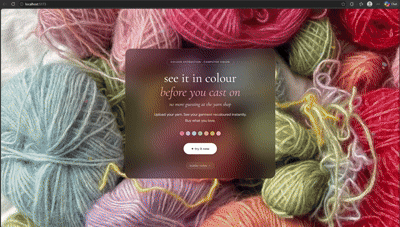

# ChromaKnit Frontend

A React + TypeScript app for previewing yarn colours on garments before you cast on. Pick a yarn (sample or upload), then see the garment recoloured with that yarn's palette. Three interaction modes: Auto (recolour the whole garment), Paint (brush a region), and Select (click a similar-colour region, stubbed for Phase 3).

The frontend is one half of a two-tier deployment that targets £0 / month: Vercel Hobby serves the SPA, and a HuggingFace Space (sleep-on-idle) runs the Python backend. See [ADR 011: Cost discipline and static-first](../docs/decisions/011-cost-discipline-and-static-first.md) for the constraint that shapes most of the architecture below.



## Architecture at a glance

```
   Masthead (persistent)
   │
   └── Hero ──click "Start"──► Stage
                                 │
                                 ├─ YarnPicker (modal)  ──► YarnPalette (side)
                                 ├─ ModeToolbar         ──► auto | paint | select
                                 └─ GarmentStage        ──► render recolour
```

State lives in a single `useReducer` ([hooks/useAppState.ts](src/hooks/useAppState.ts)). The reducer is pure: all fetches, file reads, UUIDs, and blob URLs are produced by [App.tsx](src/App.tsx) and dispatched as `*_SUCCESS` / `*_ERROR` actions. Action names describe what already happened, not what to do.

Yarn palettes persist to `localStorage` under a versioned key (`chromaknit:state`, version `1`). Garment sessions and recoloured blobs are session-scoped only.

### The static-vs-API decision

Every yarn click against every sample garment must be free. The frontend enforces this by branching on a session-id sentinel:

| Garment source | Session id | Recolour path |
|---|---|---|
| Upload | Server-issued from `POST /api/garments/session` | `POST /api/garments/recolor` |
| Sample | `static-<slug>` | [lib/recolourLocal.ts](src/lib/recolourLocal.ts) (HSV remap in the browser) |

The client-side engine is a port of the Python reference and is locked to it by a parity test against a captured RGBA fixture ([lib/recolourLocal.parity.test.ts](src/lib/recolourLocal.parity.test.ts)). If the Python pipeline changes, the parity test fails until the JS port catches up.

A separate guard prevents silent fallback: if a sample's precomputed JSON is missing (e.g. a new sample shipped without re-running `scripts/precompute_samples.py`), the yarn surfaces an error rather than hitting `/api/colors/extract` and quietly burning quota.

## Project layout

```
src/
├── App.tsx                  # Component-level side effects: fetches, abort controllers, blob lifetimes
├── App.css                  # Page-level styles
├── index.css                # Design tokens and keyframes
├── config.ts                # API base URL from VITE_API_URL
├── main.tsx                 # React entry
│
├── hooks/
│   └── useAppState.ts       # Reducer, action types, localStorage hydration
│
├── lib/
│   ├── recolourLocal.ts     # Client-side HSV recolour engine for the static path
│   └── __fixtures__/parity/ # Captured RGBA + mask for the parity test
│
└── components/
    ├── Hero.tsx             # Landing surface with "Start" CTA
    ├── Masthead.tsx         # Persistent top bar above both Hero and Stage
    ├── YarnPicker.tsx       # Modal: pick a sample or upload a yarn image
    ├── YarnPalette.tsx      # Side rail of loaded yarns with active-yarn selection
    ├── ModeToolbar.tsx      # auto | paint | select switcher
    ├── GarmentStage.tsx     # Upload zone, recolour render, paint canvas
    ├── ReportIssue.tsx      # Floating button → pre-filled GitHub Issue
    └── ErrorBoundary.tsx    # Top-level error boundary
```

Tests sit next to the code they cover (`*.test.tsx` / `*.test.ts`); the test setup is in [src/test-setup.ts](src/test-setup.ts).

## State and data flow

The reducer in [useAppState.ts](src/hooks/useAppState.ts) is the source of truth for everything user-visible. Key invariants:

- **Yarns** are added in `pending` status, then resolved to `ready` or `error`. The active yarn is `null` or a yarn id; removing the active yarn nulls it.
- **Garment sessions** carry the foreground mask (decoded from a base64 PNG returned by the session endpoint on upload, or fetched from a static PNG on the sample path) and a garment-wide brightness range. On upload, the range is computed in the browser from the original image; on the sample path it's baked into the precomputed JSON. Either way it's resolved once per session so paint strokes share a normalisation window and don't seam.
- **Regions** are committed paint or select results, each with a mask tied to the current garment's coordinate space. Changing garments clears regions.
- **Recolour cache** is a per-yarn `Map<yarnId, blobUrl>` ref in [App.tsx](src/App.tsx). Cache hits short-circuit straight to the rendered output without hitting the engine; switching garments revokes the whole cache.

Cancellation: every fetch in [App.tsx](src/App.tsx) holds an `AbortController` ref. A newer click aborts the older request, including the static path (the controller doubles as a "did a newer recolour start" flag).

Undo: `Ctrl/Cmd-Z` removes the most recently committed region. Detection uses `e.code === "KeyZ"` first so non-QWERTY layouts work, and is suppressed inside text-shaped inputs and `contentEditable`. Full undo/redo lands in Phase 2.F.

## Backend integration

| Endpoint | Method | When |
|---|---|---|
| `/api/colors/extract` | POST | Uploaded yarn only. Sample yarns load `/samples/precomputed/yarns/<slug>.json`. |
| `/api/garments/session` | POST | Uploaded garment only. Returns `session_id`, dimensions, and a base64 foreground mask PNG. |
| `/api/garments/recolor` | POST | Uploaded garment + any yarn. Sample garments take the static path. |

Static asset paths the frontend loads directly (no backend):

- `/samples/precomputed/yarns/<slug>.json` — `palette` (hex array) and `percentages`
- `/samples/precomputed/garments/<slug>.json` — `width`, `height`, `brightnessRange`, and `maskPath` pointing at the foreground mask PNG

The slugify rule (`label.toLowerCase().replace(/ /g, "-")`) mirrors `scripts/precompute_samples.py` and is the contract between the two.

## Local development

### Prerequisites
- Node.js 20.19+ or 22.12+ (required by Vite 7)
- Backend running at `http://localhost:8000` if you need the upload paths; sample-only flows work offline

### Install and run

```bash
cd chromaknit-frontend
npm install
npm run dev          # http://localhost:5173
```

### Environment

| Variable | Default | Set in |
|---|---|---|
| `VITE_API_URL` | `http://localhost:8000` | [.env.development](.env.development), [.env.production](.env.production) |

The production build points at the HuggingFace Space backend.

### Scripts

```bash
npm run dev          # Vite dev server with HMR
npm run build        # tsc -b && vite build (typecheck is part of build)
npm run preview      # Serve the production build locally
npm run lint         # ESLint over the whole tree
npm run test         # Vitest in watch mode
npm run test -- --run   # One-shot, exits after first pass
```

## Testing

Vitest + Testing Library + happy-dom. See [ADR 008: Frontend testing strategy](../docs/decisions/008-frontend-testing-strategy.md) for the rationale.

Three categories of tests, in order of how often they catch real bugs:

1. **Parity** ([lib/recolourLocal.parity.test.ts](src/lib/recolourLocal.parity.test.ts)) locks the JS recolour engine to the Python reference using a captured fixture. This is the test that protects the cost guarantee.
2. **Reducer** ([hooks/useAppState.test.ts](src/hooks/useAppState.test.ts)) exercises every action against a pure reducer. No mocks.
3. **Component** ([App.test.tsx](src/App.test.tsx), [components/YarnPalette.test.tsx](src/components/YarnPalette.test.tsx)) covers user-facing flows.

There is also a design-token regression test ([no-legacy-tokens.test.ts](src/no-legacy-tokens.test.ts)) that fails if removed colour tokens reappear in CSS.

## Deployment

- **Frontend**: Vercel (free tier), built from this directory. `VITE_API_URL` in [.env.production](.env.production) points at the live backend.
- **Backend**: HuggingFace Spaces, Docker SDK, sleep-on-idle. The image is defined by the `Dockerfile` at the repo root.

A cold request after the Space has gone to sleep pays a wake-up delay before the first response. Sample-only flows are not affected because they never call the backend.

A [render.yaml](../render.yaml) blueprint also exists for Render as a fallback target; it is not the current deployment.

## Form factor

Primary canvas is a ~1440 × 720 effective viewport (MacBook-class laptop). The layout still works on smaller screens but the stage grid is designed around the desktop case.

## Relevant ADRs

- [004: React frontend architecture](../docs/decisions/004-react-frontend-architecture.md)
- [005: Performance optimisation strategy](../docs/decisions/005-performance-optimization-strategy.md)
- [006: UI redesign](../docs/decisions/006-ui-redesign.md)
- [008: Frontend testing strategy](../docs/decisions/008-frontend-testing-strategy.md)
- [009: Frontend persistence strategy](../docs/decisions/009-frontend-persistence-strategy.md)
- [010: Session storage](../docs/decisions/010-session-storage.md)
- [011: Cost discipline and static-first](../docs/decisions/011-cost-discipline-and-static-first.md)
